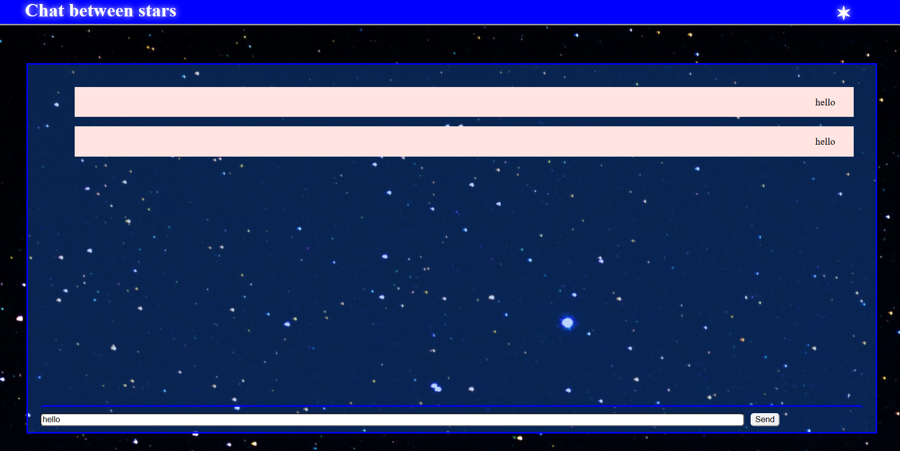

# Chat between starts

This is  a demo end exercice for  a  cht application  with Angular and websockets.

#Screenshot

## Running Tests

The application has some problems when transmiting data  because of CORS policies.

## Acknowledgements

 - [Awesome README](https://github.com/matiassingers/awesome-readme)
 - [How to write a Good readme](https://bulldogjob.com/news/449-how-to-write-a-good-readme-for-your-github-project)
 - [Initial demo](https://www.youtube.com/watch?v=XAJes51k-Fo&list=LL&index=1)
 - [Socket documentation](https://socket.io/docs/v4/)
